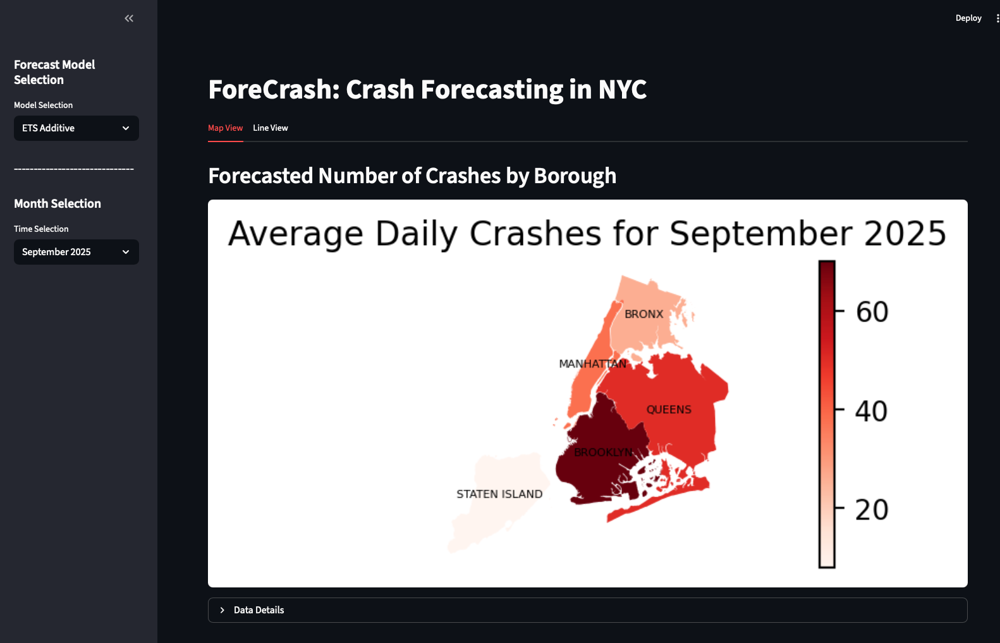
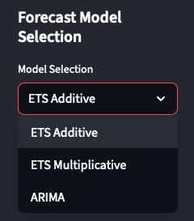
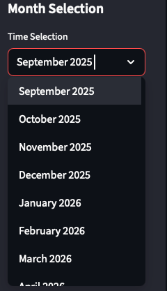
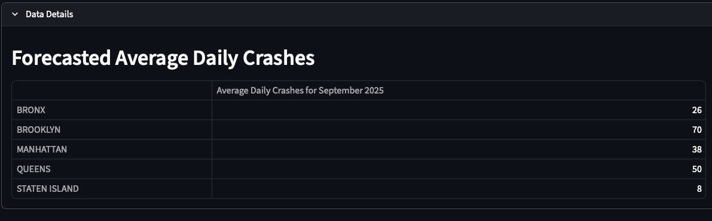
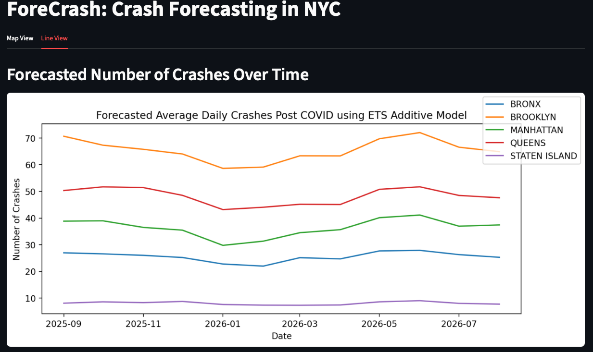

# ForeCrash: Crash Forecasting in NYC

## Python Version

This app was built with python version 3.12

Python version 3.13 yielded problems when pip installing pmdarima package.

## Files

- app.py: Main app logic
- helper.py: helper functions to support app
- requirements.txt: dependency information
- Motor_Vehicle_Collisions_-_Crashes.csv: downloaded crash data used by app
- nybb* : geometry files for plotting the NYC boroughs

## Installation and Launching Instructions

1. In a terminal or IDE navigate to folder with project files.
2. If using a virtual environment (.venv), activate the virtual environment.
3. Run the command: pip install -r requirements.txt
4. This will install all necessary dependencies for the app and helper logic.
5. Please note the older version of numpy. This is needed for compatability with the pmdarima pacakge
6. In a terminal, run the command: streamlit run app.py
7. This will launch the app on your localhost server and should open a browser window to view the app.

## App Interaction Instructions

### App Layout

The app layout should look as follows:

### Sidebar

The sidebar contains selectors for the forecasting model as well as the month to forecast the average daily crashes for.

Clicking the Model selection dropdown provides the following 3 options:

ETS is an exponential smoothing model. The additive and multiplicative refer to the seasonal component.

ARIMA is using auto-ARIMA to find the best ARIMA model.

Clicking the Time Selection dropdown provides the following options: 

The selection will update the map visualization for the month and year selected.

### Data Details

For actual projected number of average daily crashes in the month selected, click the Data Details expander.

This table will also update with the month and year selected from the Time Selection dropdown.

### Line View

Selecting the line view option gives the user the ability to see the forecasts for all boroughs for the next year all at once
